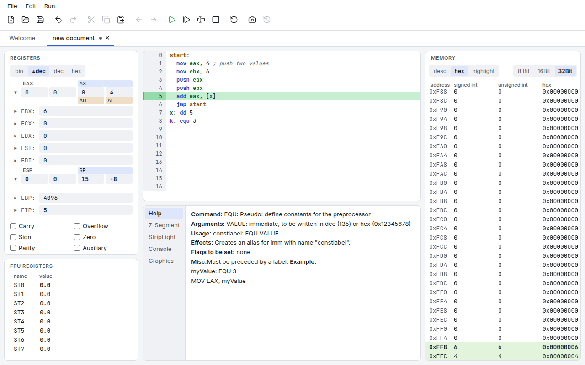
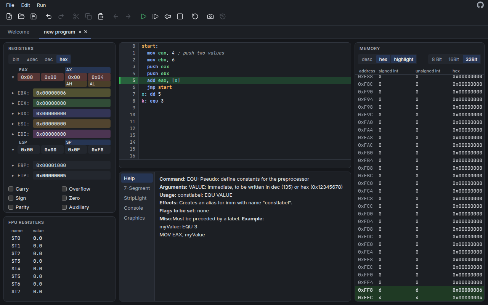

# jasmin-port

A browser version of **Jasmin**, the x86 assembler simulator from the Technische
Universität München, rewritten in TypeScript and Angular. It looks and behaves like
the original Java desktop application and runs entirely client-side: no server, no
install, just a static web page that keeps working offline once loaded.



## What it is

Jasmin (Java Assembler Interpreter) was developed by second-term students for the
[Chair of Computer Architecture (LRR)](http://www.lrr.in.tum.de) at TUM as a learning
tool for x86 assembler. You write assembly code, step through it line by line, and
watch registers, flags, memory, the stack, the FPU and simple I/O devices change.

This port keeps the original's layout, labels, colors' meanings, number formats,
messages and keyboard shortcuts, so course material and screenshots still match, and
replaces the Swing look with a modern one, including a dark theme.

## Features

- **Editor** with syntax highlighting from the interpreter's own parser, the 0-based
  line gutter (line number = EIP), breakpoints (click the gutter, or F8), set EIP
  (right-click the gutter), the green execution mark, auto-indent, and the error line.
- **Run, Step, Execute current line, Pause, Stop, Reset** and snapshots, with a
  time-sliced run loop: endless loops stay pausable, a million instructions take
  about a second.
- **Registers** in bin, ±dec, dec and hex, expandable to EAX/AX/AH/AL bytes, bold on
  change, editable; **flags**; the **FPU** stack; and **memory** as a virtualized
  table (megabytes scroll smoothly) with 8/16/32-bit cells, stack tint, register
  highlighting and in-place editing.
- **Context help** for every instruction, following the caret (the original's help
  pages).
- **I/O devices**: 7-Segment display, StripLight, Console and Graphics, memory-mapped
  and live while the program runs.
- **Files**: open and save `.asm` code and `.mem` machine snapshots (File System Access
  API where available, downloads elsewhere); unsaved-changes warning on leaving.
- **Configuration**: editor font and size, memory size and start address, help
  language, and the theme (System, Light, Dark). Settings are stored in the browser.
- **Keyboard and screen readers**: everything works without a mouse. F10 focuses the
  menu bar; the toolbar and the tab strips are single tab stops navigated with the
  arrow keys; split dividers move with the arrow keys; in the editor, Tab inserts a
  tab and Escape then Tab moves on. Both themes meet WCAG AA contrast, checked by
  [axe](https://github.com/dequelabs/axe-core) in the end-to-end tests.

| Shortcut | Action | | Shortcut | Action |
|---|---|---|---|---|
| Alt+N | New (Ctrl+N is reserved by browsers) | | F5 | Run |
| Ctrl+O | Open Code | | Ctrl+P | Pause |
| Ctrl+S / Ctrl+Shift+S | Save Code / Save Code As | | F7 | Step |
| Ctrl+Z | Undo | | F9 | Execute current line |
| Ctrl+R, Ctrl+Y, Ctrl+Shift+Z | Redo | | F8 | Toggle breakpoint (editor) |
| F10 | Focus the menu bar | | | |



## Differences from the original

The port fixes crashes and clear bugs of Jasmin 1.5.11 and keeps its intentional
simplifications. Every deviation is listed with its reason in
[spec/07-known-quirks.md](spec/07-known-quirks.md) (`FIX` items). Desktop-only
features have web equivalents: browser file dialogs, a viewport-filling window, a
JSON `.mem` format (old Java `.mem` files cannot be imported), Alt+N instead of
Ctrl+N, and F10 instead of the Alt+F/E/R menu mnemonics, which browsers keep for
their own menus.

## Running it

Requires Node.js 24 (see `.nvmrc`; 22.22.3+ also works).

```
npm ci
npm start                 # dev server at http://localhost:4200
```

### Building a static site

```
npm run build             # dist/jasmin-port/browser/, served from the web root
npm run build:static      # the same, for https://<host>/jasmin-port/
npm run build -- --base-href /some/path/   # for any other sub-path
```

Copy `dist/jasmin-port/browser/` to any static host. The app has no routes, so no
rewrite rules are needed. The GitHub Actions workflow
[`.github/workflows/pages.yml`](.github/workflows/pages.yml) deploys every push to
`main` to GitHub Pages at https://hashseed.github.io/jasmin-port/ (Pages must be
enabled with "GitHub Actions" as the source; private repositories need a paid plan).

## Development

```
npm run lint              # ESLint (including the core import rules)
npm run format:check      # Prettier (npm run format to fix)
npm run typecheck         # tsc over the app, the specs, the headless runner and e2e
npm test                  # unit tests: core and devices in Node, components in jsdom
npm run conformance       # spec/conformance programs against the headless runner
npm run e2e               # Playwright end-to-end tests, including axe and performance
```

`npm run e2e` starts a dev server on port 4300. Set `PW_CHROMIUM_PATH` to use a
preinstalled Chromium; otherwise run `npx playwright install chromium` once.

The **conformance tests** run 44 assembly programs headlessly and compare the final
machine state with outputs recorded from the original interpreter
([spec/08-conformance.md](spec/08-conformance.md)). To check the expectations against
the original Java implementation itself (needs a JDK and git; it clones and compiles
upstream Jasmin), run:

```
bash spec/conformance/run-conformance.sh java
```

CI ([`.github/workflows/ci.yml`](.github/workflows/ci.yml)) runs all of the above on
every pull request; the Java run is a separate manual workflow.

### Architecture

```
src/
  app/
    core/       the interpreter: parser, machine (DataSpace, FPU), instructions,
                MachineSession (run loop, breakpoints, snapshots). Plain TypeScript,
                no Angular, DOM or Node imports (enforced by ESLint)
    devices/    the I/O device models (7-Segment, StripLight, Console, Graphics):
                memory-mapped state and layout, also framework-free
    services/   Angular services: one DocumentStore per tab (mirrors a MachineSession
                into signals), actions and enablement rules, keyboard shortcuts,
                files, settings
    ui/         standalone components with signals and OnPush: shell (menu bar,
                toolbar, tabs), document layout and split panes, CodeMirror editor,
                panels, help pages, device canvases, dialogs
    theme/      design tokens (CSS custom properties) for the light and dark themes
  headless/     run.ts: the Node runner used by the conformance tests
public/         help pages, images and icons from the original (see NOTICE.txt)
e2e/            Playwright tests
spec/           the specification of the original's UI and behavior
docs/plan.md    implementation plan, milestones and visual direction
```

The UI never computes machine behavior itself: each command goes to the session in
`core/`, which emits events; the document store bumps a version signal and the panels
re-render from the machine state. Syntax highlighting comes from the same parser, so
colors always agree with what the interpreter thinks a token is.

## How this port was made

This port was written by Claude Opus 5.5 (Anthropic) in Claude Code, with a person
directing the work and making the judgment calls. The model first wrote a behavioral
specification from the Java source ([`spec/`](spec/README.md)), including a list of
the original's quirks, each marked FIX or KEEP
([`spec/07-known-quirks.md`](spec/07-known-quirks.md)). It then built the app in
milestones ([`docs/plan.md`](docs/plan.md)). Every pull request had to pass CI,
including 44 conformance programs run headlessly against both the original Java
interpreter and the port.

## The original

- Source: <https://github.com/TUM-LRR/Jasmin> (last release 1.5.11, 2016)
- Older releases: <https://sourceforge.net/projects/tum-jasmin/>

## License and credits

GNU General Public License, version 2 only (GPL-2.0-only), the same license as the
original. See [LICENSE.md](LICENSE.md).

Jasmin was created at the Lehrstuhl für Rechnertechnik und Rechnerorganisation,
Technische Universität München. Initial development by Yang Guo, Jakob Kummerow, Kai
Orend and Stefanie Schmid; initial documentation and tutorials by André Aichert,
Mattias Kaiser and Sebastian Ullherr; maintained by Marcel Meyer, with additional
credits to Johannes Roith and Alexander Ried. The port reuses the original's help
pages, logo and photos ([public/NOTICE.txt](public/NOTICE.txt)).

The port uses [Angular](https://angular.dev), [CodeMirror](https://codemirror.net),
[Lucide](https://lucide.dev) icons (ISC) and the [Inter](https://rsms.me/inter/) and
[JetBrains Mono](https://www.jetbrains.com/lp/mono/) fonts (OFL).
